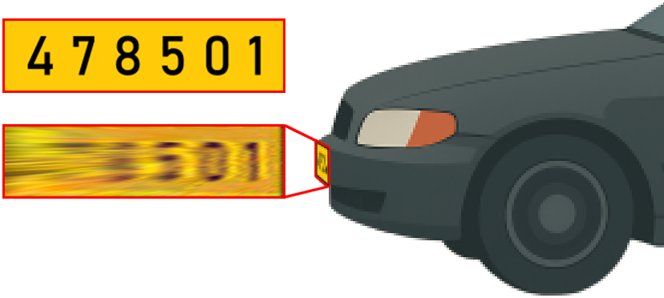
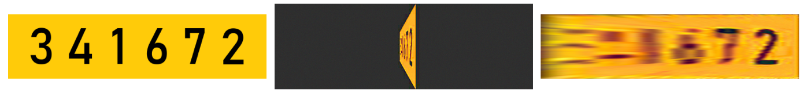
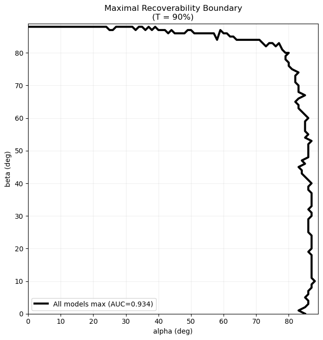
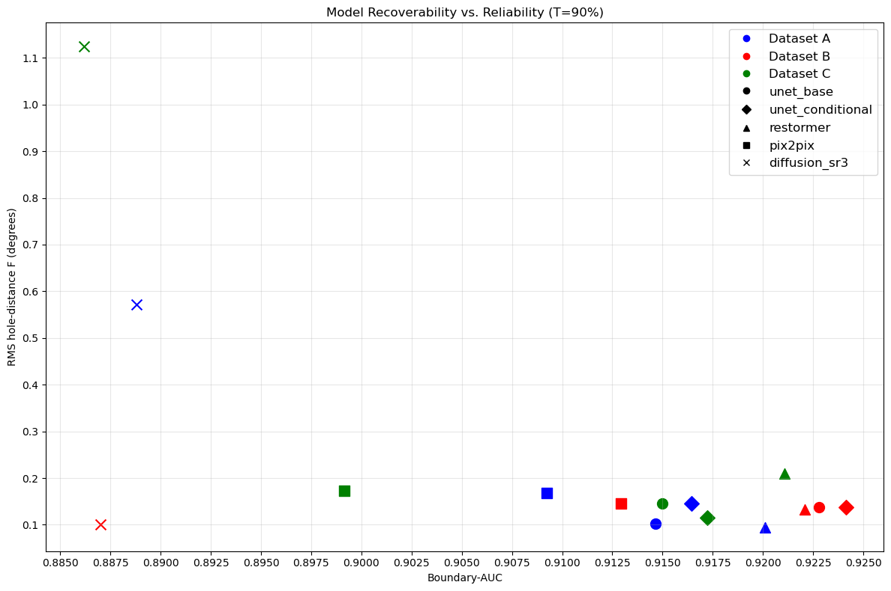
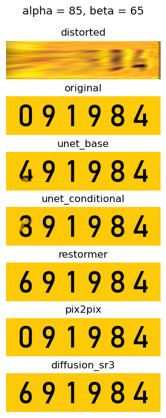
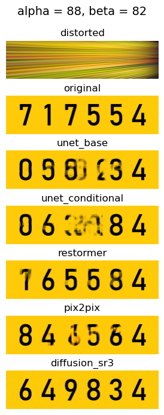
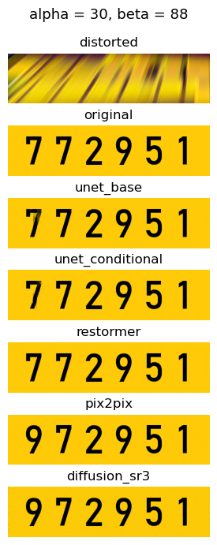

# Generative Image Models for Enhancing License Plate Images Captured at Extreme Viewing Angles

---

## Abstract

**License Plate Recognition (LPR)** systems typically rely on high-quality images captured under controlled conditions. Street, security, and ATM cameras often capture vehicles so that license plates are seen at an angle, and the plates appear noisy due to low quality. This study investigates whether deep-learning image-restoration models can reconstruct such plates and determines the maximum extent of viewing angles at which recovery remains possible. We compare a classic **U-Net** architecture with generative approaches such as **generative adversarial networks (GANs)** and **diffusion models** for reconstructing warped, noisy plates.

We create synthetic datasets that simulate a wide range of viewing angles and noise levels to provide controlled test conditions. The study highlights the strengths and limitations of each model and maps the recoverability boundary beyond which models can no longer restore plate images.

---

## Introduction

LPR systems support traffic control and law enforcement. In controlled scenes the cameras are mounted at fixed angles, under steady lighting, and at known distances, so plate numbers are captured cleanly. Outside these controlled scenes, however, ordinary cameras — for example, those at ATMs or in street surveillance — record plates at steep angles and with compression artifacts and noise. In these settings, plate numbers often disappear entirely or become difficult to recognize, even for human observers.

**Research Question:** At which viewing angles can different models recover noisy plates that are unrecognizable to humans?

---

## Objectives

- Compare discriminative models (U-Net, U-Net Conditional, Restormer) and generative models (GAN Pix2Pix, Diffusion SR3) on synthetic clean-distorted plates.
- Identify the maximum (α, β) rotation angles that deep-learning models can restore on synthetic license plate images.
- Quantify recoverability by mapping plate OCR accuracy ≥ 90% on a full-grid [0°, 89°]².

---

## Methodology

**Data Generation**

- Generate clean synthetic plates by rendering random 6-digit numbers on a yellow background.
- Define two smooth PDFs over (α, β) ∈ [−90°, 90°]²: one with moderate emphasis on extreme angles, one with stronger emphasis.
- Draw 10,240 and 20,480 (α, β) samples from the moderate PDF to create Datasets A and B; draw 10,240 samples from the stronger PDF to create Dataset C.
- Warp each plate using sampled (α, β) angles and simulate camera artifacts through edge blending, color jitter, Gaussian blur, and JPEG compression. De-warp each plate and downscale to 256×64 pixels.
- Store each clean-distorted image pair with its (α, β) angle and plate number labels into 80/10/10 train, validation, and test sets.

*Original plate → warped and noisy → de-warped*

**Training & Evaluation**

- Train models and tune hyperparameters by tracking PSNR and SSIM on the validation sets.
- Evaluate on a full-grid [0°, 89°]² of integer angle pairs; record plate-level OCR accuracy, trace the recoverability boundary, and compute boundary-AUC and reliability F.

---

## Models

| Model | Type |
|---|---|
| U-Net | Discriminative (baseline) |
| U-Net Conditional | Discriminative (FiLM-conditioned) |
| Restormer | Discriminative (Transformer-based) |
| GAN Pix2Pix | Generative |
| Diffusion SR3 | Generative |

Each model takes a distorted plate image and returns a restored image of the same size (256×64).

---

## Results

### Training Results (Test Split)

| Model | PSNR (A) | SSIM (A) | PSNR (B) | SSIM (B) | PSNR (C) | SSIM (C) | Train Time (norm.) | Latency (ms) |
|---|---|---|---|---|---|---|---|---|
| U-Net (baseline) | 23.66 | 0.9705 | 24.45 | 0.9762 | 20.96 | 0.9464 | 1.00× | 11.75 |
| U-Net Conditional | 24.18 | 0.9743 | 24.70 | 0.9773 | 21.35 | 0.9508 | 1.19× | 7.50 |
| Restormer | 24.71 | 0.9762 | 25.34 | 0.9777 | 21.67 | 0.9563 | 14.87× | 14.01 |
| GAN-Pix2Pix | 23.21 | 0.9672 | 23.48 | 0.9708 | 19.97 | 0.9177 | 1.23× | 7.34 |
| Diffusion-SR3 | 21.74 | 0.9315 | 21.74 | 0.9407 | 19.34 | 0.9052 | 4.69× | 21.81 |

### Full Grid Evaluation (Boundary-AUC and Reliability F)

| Model | AUC (A) | F (A) | AUC (B) | F (B) | AUC (C) | F (C) |
|---|---|---|---|---|---|---|
| U-Net (baseline) | 0.915 | 0.103 | 0.923 | 0.138 | 0.915 | 0.146 |
| U-Net Conditional | 0.916 | 0.145 | 0.924 | 0.137 | 0.917 | 0.115 |
| Restormer | 0.920 | 0.095 | 0.922 | 0.133 | 0.921 | 0.209 |
| GAN-Pix2Pix | 0.909 | 0.168 | 0.913 | 0.145 | 0.899 | 0.173 |
| Diffusion-SR3 | 0.889 | 0.572 | 0.887 | 0.100 | 0.886 | 1.124 |

---

## Key Findings

- **Discriminative models** exhibit tight clustering in full-grid coverage, with boundary AUCs ranging from 0.920 to 0.924 and reliability F values in the 0.1–0.15 range.
- **Generative models** are lower by about 1–3% AUC; Pix2Pix shows F ≈ 0.15, while SR3 ranges from 0.10 on the best dataset to > 0.50 on others, indicating deeper interior failures.
- **U-Net Conditional and Pix2Pix GAN** train within 1–1.2× U-Net's (baseline) time, with latency of 7–12ms on an RTX 3090; Restormer requires 15× training time and has 14ms latency; diffusion is 4.7× slower to train and has 22ms latency due to multi-step sampling.
- The **maximal recoverability boundary** shows that about 93.4% of the [0°, 89°]² full-grid contains recoverable signal. No model achieves ≥ 90% OCR accuracy beyond 80° in both α and β, and α rotations are generally harder to reconstruct than β rotations.
- **PSNR correlates linearly** with plate-level OCR accuracy (R² ≈ 0.98) and shows low variance at similar PSNR levels, confirming PSNR as a reliable validation indicator. SSIM is less effective (R² ≈ 0.74); values below 0.92 yield near-zero OCR, and OCR variance remains high at similar SSIM values.
- **Doubling training data** from 10k to 20k yields a marginal AUC gain (< 0.01); recoverability is influenced more by sample distribution.

| Maximal Recoverability Boundary | Recoverability vs. Reliability (AUC vs F) |
|:---:|:---:|
|  |  |

---

## Failure Modes

- **Discriminative models** (U-Net, U-Net Conditional, Restormer) respond to low signal by producing blurred or ambiguous digits.
- **GAN-Pix2Pix** typically generates fewer blurry digits but more often creates hybrid or incomplete digits, and may produce color artifacts.
- **Diffusion models** always produce samples from the clean plate distribution — the output visually resembles a clean license plate even when the input is heavily distorted. However, in areas where signal is too weak, diffusion models tend to hallucinate digits and generate plausible but incorrect plate numbers.

| U-Net / U-Net Conditional | Pix2Pix GAN | Diffusion SR3 |
|:---:|:---:|:---:|
|  |  |  |

---

## Conclusions

Discriminative architectures outperform their generative counterparts by a small margin and are easier to adapt, train, and tune. Their explicit loss functions make validation straightforward, whereas GANs and diffusion models lack clear quantitative signals; diffusion adds further complexity through multi-step sampling. Restormer delivers the best accuracy, while Diffusion-SR3 remains the hardest to stabilize and lags under severe distortion. The maximal recoverability boundary traces the outer envelope of usable signal, confirming that all models converge on the same ≈93% recoverable region; once both angles exceed ~80°, the residual information is too weak and further gains are unlikely.

---

## Future Work

- Extend data generation to include varying plate distances, better reflecting real-world static cameras viewing vehicles at different distances.
- Build a real data pipeline using fixed cameras and sensors to record actual images and angle information, then test models on this data.
- Adapt this synthetic-data framework to other domains requiring oblique-view restoration, such as signage or document imaging.

---

## Project Framework Overview

All code is run in a dedicated Anaconda environment (`environment.yml`), which includes PyTorch, OpenCV, Tesseract OCR, MLflow, and other required libraries. Installing and activating this environment ensures all dependencies are available for every script. The project is organized as follows:

- **scripts/** – `lp_processing.py` for data generation, splitting, and storing; `run_inference.py` for inference on the full grid and saving the resulting images; `compute_metrics.py` for evaluation.
- **models/** – Contains model code such as official PyTorch models from GitHub (e.g., Restormer), and adapted or custom models.
- **src/** – Contains training scripts for each model in the form `train_{model_name}.py`, shared utility functions in `utils.py`, and a custom `lp_dataset.py` class used with data loaders to feed data into models during training.
- **data/** – Data folder containing dataset folders A, B, C, and a `full_grid` folder. Each dataset contains subfolders for train, validation, and test splits, with images and a metadata file. `full_grid` directly includes all images and metadata.
- **Jupyter Notebooks** – Notebooks at the project root for experimentation and analysis. `ocr_test.ipynb` used for testing OCR, `sampling.ipynb` for experimenting and visualizing PDF and sampling, `report_artifacts.ipynb` for report figures, and `results.ipynb` for organizing, analyzing, and making figures of raw results data from CSV files.

---

### Dataset Generation

`lp_processing.py` runs the full dataset generation pipeline, from creating clean plates to saving them in the data folder. All parameters — plate dimensions, font, sampling PDF, number of samples, etc. — can be set in main. By default, three datasets are created and saved in `data/{dataset}/split/` folders as paired `original_{index}.png` and `distorted_{index}.png` images. Each split includes a `metadata.json` file that records the plate text, distortion angles, and bounding boxes for every digit. A fixed random seed is used for reproducibility.

---

### Models and Training Workflow

The `models/` folder stores all models: U-Net, Conditional U-Net, Restormer, Pix2Pix GAN, Diffusion SR3. Each model takes a distorted plate image and returns a restored image of the same size.

Training scripts (`src/`) all follow the same steps:

- **Configuration**: reads command-line arguments and builds a config with epochs, batch size, learning rate, weight decay, and any model-specific settings.
- **Data loading**: the custom `LicensePlateDataset` class reads all image pairs into memory once and applies any necessary transforms (tensor conversion, normalization). PyTorch DataLoaders turn the dataset class into an iterable over batches, shuffle batches (only for training set), and deliver them to the model in the training loop.
- **Model setup**: the selected model is moved to the GPU. The script defines a loss (e.g., MSE) and an optimizer (e.g., AdamW), and a learning rate scheduler (e.g., CosineAnnealingLR). A fixed seed fixes data order and weight initialization.
- **MLflow tracking**: the script starts an MLflow run, logs hyperparameters, and copies the training script and model file as artifacts. Metrics and sample images are logged during training and can be accessed through the MLflow UI.
- **Training loop**: for U-Net and GANs, each epoch shuffles batches, runs forward pass, computes loss, back-propagates, updates weights, then runs a no-gradient validation pass. Diffusion follows the same cycle, but first adds noise to each input and predicts that noise across scheduled timesteps. The script keeps the model state with the best validation SSIM.
- **Post-training**: the best model weights are loaded, evaluated on the unseen test set, and logged with an environment file for dependencies.

---

### Inference and Evaluation Scripts

- **`run_inference.py`** – loads trained models from MLflow and applies them to the `data/full_grid/` set. For U-Net, U-Net Conditional, Restormer, and Pix2Pix, each distorted image is fed through the network and the restored output is saved in `results/{dataset}/{model}/`. For the diffusion model, it performs the scheduled denoising loop before saving. Average inference time per image is written to `inference_times.csv`. Command-line flags control model names, batch size, and diffusion sampling steps.
- **`compute_metrics.py`** – compares each reconstructed image with its clean original. It looks up the plate text, angle pair, and digit boxes in `metadata.json`, and reports plate-level and digit-level metrics. Runs Tesseract in digit mode; if recognition fails or is incomplete, tries alternative preprocessing or full-plate identification. All raw values are saved to `results/{dataset}/{model_name}.csv`.
- **`run_all.py`** – automates the full workflow for any dataset A, B, or C: runs training scripts in sequence, then calls `run_inference.py`, then `compute_metrics.py`. Can be configured to enable or skip specific models and steps. This allows running the entire pipeline with a single command once the data is available.

---

### Jupyter Notebooks

Several notebooks are included at the project root for checking, validation, and making figures — not part of the main pipeline.

- **`ocr_test.ipynb`** – tests OCR and preprocessing steps on distorted plates. The final approach confirmed here is used in `compute_metrics.py`.
- **`report_artifacts.ipynb`** – makes the figures and sample images used in the project report.
- **`sampling.ipynb`** – tests the sampling distribution for rotation angles, plots PDFs, and compares sampling methods. An extension to `report_artifacts.ipynb`.
- **`results.ipynb`** – loads CSV files from `compute_metrics.py` as pandas dataframes, computes means per angle pair, and produces heatmaps, bar charts, scatter plots, and tables for the final report.

---

## Contributors

**Department of Electrical Engineering — Final Year Project**
**Authors:** Igor Adamenko, Orpaz Ben Aharon
**Supervisor:** Dr. Sasha Apartsin

---

## Full Report

The full project report is available in [`report/`](report/).
